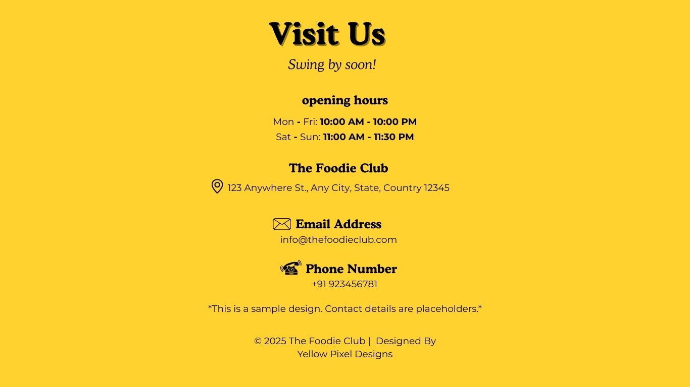

# restaurant-website
A clean and responsive restaurant website built using HTML and CSS. it includes sections for Home, Menu, About and Contact. This design is simple, modern and easy to customize. Perfect for small restaurants, cafes, or food businesses that want a basic online presence. Beginner-friendly code and mobile-responsive layout.
## Live Website
 https://yellowpixeldesigns.github.io/restaurant-website/
## Preview

## Features
- Responsive layout
- beginner project
- Navigation Bar
- frontend
- Menu Section
- Chef special section
- Contact section
## Technologies
- HTML
- CSS
